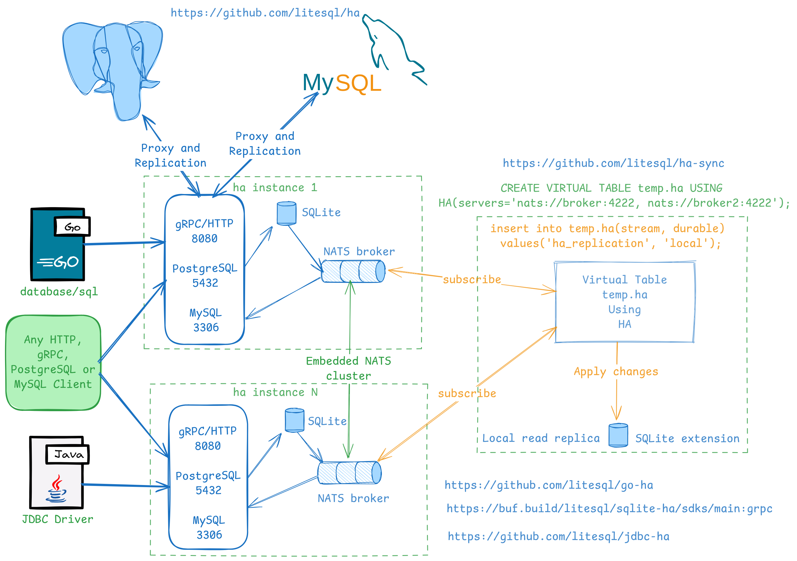

# HA - Highly Available SQLite Cluster

[](https://opensource.org/licenses/Apache-2.0)
[](https://golang.org/)
[](https://liberapay.com/walterwanderley/donate)
[](https://liberapay.com/walterwanderley/donate)
[](https://liberapay.com/walterwanderley/donate)



HA is a highly available SQLite cluster powered by an embedded NATS JetStream server. It provides distributed SQLite databases with replication, supporting multiple protocols for seamless integration.

## Table of Contents

- [Features](#features)
- [Installation](#installation)
- [Quick Start](#quick-start)
- [Configuration](#configuration)
- [Usage](#usage)
- [API Documentation](#api-documentation)
- [Contributing](#contributing)
- [License](#license)

## Features

- 🔌 **Multiple Protocols**: Connect via HTTP API, [gRPC API](https://buf.build/litesql/sqlite-ha/sdks/main:grpc), [database/sql Go driver](https://github.com/litesql/go-ha), [JDBC driver](https://github.com/litesql/jdbc-ha), MySQL Wire Protocol, or PostgreSQL Wire Protocol
- 🔁 **Replication**: Use embedded or external NATS server for data replication
- 📝 **Read/Write Replicas**: Create live local read/write replicas with [go-ha database/sql driver](https://github.com/litesql/go-ha)
- 📚 **Read Replicas**: Create live local read replicas with [ha-sync SQLite extension](https://github.com/litesql/ha-sync)
- 🔄 **Change Data Capture (CDC)**: Supports CDC for real-time data streaming
- ⚙️ **Cluster Modes**: Configure leader-based or leaderless clusters with custom conflict resolution strategies
- 📚 **Cross-Shard Queries**: Execute queries across shards using SQL hints like `/*+ db=DSN */`
- 🔄 **Transaction Undo**: Supports undo operations on committed transactions, allowing rollback to previous states
- 📖 **Full Documentation**: [https://litesql.github.io/ha/](https://litesql.github.io/ha/)

## Installation

### Pre-built Binaries

Download the latest release from [GitHub Releases](https://github.com/litesql/ha/releases/latest).

### Build from Source

Ensure you have Go 1.26+ installed.

```bash
go install github.com/litesql/ha@latest
```

### Docker

Build the Docker image:

```bash
make docker-image
```

Or use the development image:

```bash
make docker-image-dev
```

## Quick Start

### 1. Start the First HA Instance

```bash
mkdir db1
ha -n node1 --pg-port 5432 --mysql-port 3306 "file:db1/mydatabase.db"
```

This starts:
- Embedded NATS server on port 4222
- MySQL Wire Protocol server on port 3306
- PostgreSQL Wire Protocol server on port 5432
- HTTP API server on port 8080

### 2. Start a Second HA Instance

```bash
mkdir db2
ha -n node2 --nats-port 0 -p 8081 --pg-port 5433 --mysql-port 3307 --replication-url nats://localhost:4222 "file:db2/mydatabase.db"
```

This starts:
- PostgreSQL Wire Protocol server on port 5433
- MySQL Wire Protocol server on port 3307
- HTTP API server on port 8081

It connects to the first instance's NATS server for replication.

### 3. Connect and Test

Create a table and insert data:

```sql
CREATE TABLE users(ID INTEGER PRIMARY KEY, name TEXT);
INSERT INTO users(name) VALUES('HA user');
```

Verify replication by connecting to the second instance and querying the data.

## Configuration

HA supports various command-line flags for configuration. Run `./ha --help` for a complete list.

Key options:
- `-n, --name`: Node name
- `-p, --port`: HTTP API port (default: 8080)
- `--pg-port`: PostgreSQL Wire Protocol port
- `--mysql-port`: MySQL Wire Protocol port
- `--nats-port`: NATS server port (0 to disable embedded server)
- `--replication-url`: NATS server URL for replication

For advanced configuration, see the [full documentation](https://litesql.github.io/ha/).

## Usage

### HA Client

Connect using the built-in HA client:

```bash
ha -r http://localhost:8080
```

Special commands:
- `SHOW DATABASES;`: List all databases
- `CREATE DATABASE dsn;`: Create a new database
- `DROP DATABASE id;`: Drop a database
- `SET DATABASE TO id;`: Switch to a specific database
- `UNSET DATABASE;`: Use default database
- `EXIT;`: Quit client

### Transaction Operations

- `HISTORY n`: Retrieve transactions from sequence point `n`
- `UNDO n`: Revert transactions from sequence `n`
- `UNDOE n`: Roll back entity modifications from sequence `n`
- `UNDOT n`: Revert transactions affecting entities from sequence `n`

Where `n` can be a sequence number or time duration (e.g., `'5m'`).

### PostgreSQL Client

```bash
PGPASSWORD=ha psql -h localhost -U ha -p 5432
```

### MySQL Client

```bash
mysql -h localhost --port 3306 -u ha
```

## API Documentation

- **HTTP API**: [https://litesql.github.io/ha/#5](https://litesql.github.io/ha/#5)
- **gRPC API**: [https://buf.build/litesql/sqlite-ha/sdks/main:grpc](https://buf.build/litesql/sqlite-ha/sdks/main:grpc)
- **OpenAPI Spec**: See `openapi.yaml` in the repository

## Contributing

Contributions are welcome! Please:

1. Fork the repository
2. Create a feature branch
3. Make your changes
4. Add tests if applicable
5. Submit a pull request

For major changes, please open an issue first to discuss the proposed changes.

## License

This project is licensed under the Apache License 2.0 - see the [LICENSE](LICENSE) file for details.